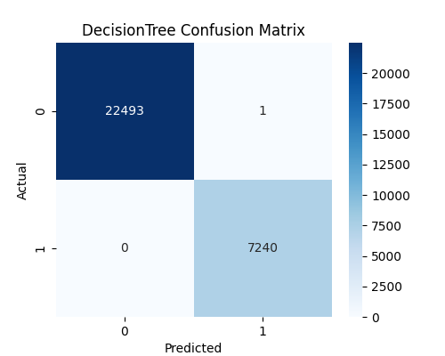

# Loan Default Prediction 🚀



**Predicting Loan Defaults using Decision Tree & XGBoost**

This project predicts whether a loan applicant will default based on historical financial and demographic data. It demonstrates an **end-to-end ML workflow**, from data preprocessing to model evaluation and visualizations.

---

## 📊 Dataset Overview

The dataset includes these features:

ID, year, loan_limit, Gender, approv_in_adv, loan_type, loan_purpose, Credit_Worthiness,
open_credit, business_or_commercial, loan_amount, rate_of_interest, Interest_rate_spread,
Upfront_charges, term, Neg_ammortization, interest_only, lump_sum_payment, property_value,
construction_type, occupancy_type, Secured_by, total_units, income, credit_type, Credit_Score,
co-applicant_credit_type, age, submission_of_application, LTV, Region, Security_Type, Status, dtir1

yaml
Copy code

- **Target Column:** `Status` (loan approved / default)

---

## 🗂 Project Structure

loan-default-prediction/
│
├─ main.py # Main entry point
├─ requirements.txt # Python dependencies
├─ data/
│ └─ loan_data.csv # Input dataset
├─ outputs/ # Generated plots, CSVs, images
└─ src/
├─ train_models.py # Model training functions
└─ evaluate_models.py # Model evaluation and visualization

yaml
Copy code

---

## ⚙ How to Run

```bash
git clone https://github.com/IrfanaAslam/loan-default-prediction.git
cd loan-default-prediction
pip install -r requirements.txt
python main.py
All outputs will be saved in the outputs/ folder.

📈 Model Evaluation & Visualizations
Confusion Matrices
Decision Tree

XGBoost

Confusion matrices show true vs predicted loan status.

ROC Curves
Decision Tree

XGBoost

ROC curves visualize true positive rate vs false positive rate. Higher AUC = better performance.

Feature Importance
Decision Tree Top 20 Features

XGBoost Top 20 Features

Shows most influential features. CSV files are saved for further analysis.

💡 Key Highlights
End-to-end ML workflow: preprocessing → training → evaluation → visualization

Handles categorical variables & cleans feature names for XGBoost

Outputs include CSV + PNG plots

Portfolio-ready: demonstrates ML & data visualization skills

🛠 Tech Stack
Python 3.10

Pandas, NumPy

scikit-learn, XGBoost

Matplotlib, Seaborn

🚀 Next Steps
Hyperparameter tuning for better performance

Deploy model as REST API using Flask/ FastAPI

Interactive dashboards for monitoring

Add more algorithms: Random Forest, LightGBM

👩‍💻 About Me
Hi! I’m Irfana Aslam, a Python developer and ML enthusiast. I build projects that combine data analysis, ML, and visualization. I focus on portfolio-ready projects that showcase real-world skills.

📫 Contact Me
Email: irfanaaslam69@gmail.com

Alternate Email: irfanaaslam0786@gmail.com

LinkedIn: linkedin.com/in/irfana-aslam

GitHub: github.com/irfana-aslam

🎯 References
XGBoost Docs

scikit-learn Docs

Pandas Docs

📂 Outputs
Copy code
outputs/
├─ DecisionTree_confusion_matrix.png
├─ DecisionTree_ROC_curve.png
├─ DecisionTree_feature_importance.png
├─ DecisionTree_feature_importance.csv
├─ XGBoost_confusion_matrix.png
├─ XGBoost_ROC_curve.png
├─ XGBoost_feature_importance.png
├─ XGBoost_feature_importance.csv
├─ project_banner.png
